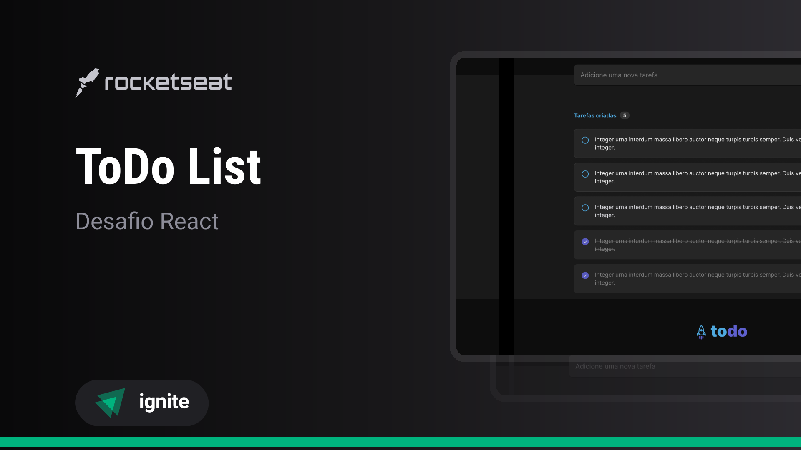

<h1 align="center"> ToDo List </h1>

  <a href="#-tecnologias">Tecnologias</a>&nbsp;&nbsp;&nbsp;|&nbsp;&nbsp;&nbsp;
  <a href="#-projeto">Projeto</a>&nbsp;&nbsp;&nbsp;|&nbsp;&nbsp;&nbsp;
  <a href="#-layout">Layout</a>

 

  

## 🚀 Tecnologias

Esse projeto foi desenvolvido com as seguintes tecnologias:

- HTML e CSS
- JavaScript
- TypeScript
- React
- Git e Github
- Figma

## 💻 Projeto

O ToDo List é uma página web para criação e controle de tarefas.

- [Acesse o projeto finalizado, online](https://jonasmaia12.github.io/to-do-list/)

## 🔖 Layout

Você pode visualizar o layout do projeto através [DESSE LINK](https://www.figma.com/file/0n0zDN7zbzhRbaEO74Xesx/ToDo-List/duplicate). É necessário ter conta no [Figma](https://figma.com) para acessá-lo.
